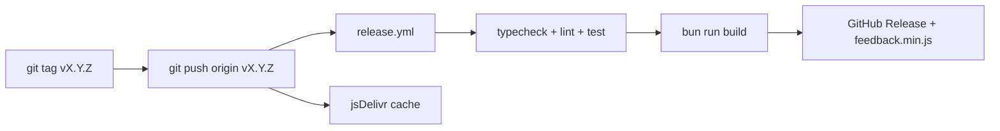

# Design: Publicacion jsDelivr via GitHub Releases

**Status:** Aprobado — listo para fase test.

## Approach

Workflow GitHub Actions disparado por push de tags `v*`. El job ejecuta quality gates (typecheck, lint, test), construye `dist/feedback.min.js` y publica un GitHub Release con el bundle adjunto via `softprops/action-gh-release@v2`.

jsDelivr sirve archivos del arbol git en el tag:

```
https://cdn.jsdelivr.net/gh/lgzarturo/feedback_widget@VERSION/dist/feedback.min.js
```

Donde `VERSION` es el tag semver (`v1.0.0`, `v1.0.1`, …).

## Flujo de release



## Plantilla HTML de integracion

```html
<div
  data-feedback
  data-api-key="TU_API_KEY"
  data-source="mi-sitio"
  data-position="bottom-right">
</div>
<script defer src="https://cdn.jsdelivr.net/gh/lgzarturo/feedback_widget@v1.0.0/dist/feedback.min.js"></script>
```

## Convenciones semver

- Tags: prefijo `v` + semver (`v1.0.0`)
- Versionado manual via `bun run release:patch|minor|major` (fuera de scope BC-014)
- Usuario GitHub fijo: `lgzarturo/feedback_widget` (confirmado por remote origin)

## Verificacion manual

1. Cambiar temporalmente el `src` del script en `playground/index.html` a la URL jsDelivr
2. Ejecutar `bun run playground`
3. Confirmar boton flotante y modal funcionales
4. jsDelivr puede tardar minutos en cachear un tag nuevo

## Files Affected

| Archivo | Accion |
|---------|--------|
| `.github/workflows/release.yml` | crear |
| `README.md` | seccion CDN jsDelivr |
| `CHANGELOG.md` | entrada `[1.0.0]` |
| `tests/release/release.test.ts` | tests BC-014 |

## Acceptance Criteria

- [ ] Push de tag v* dispara workflow que adjunta dist/feedback.min.js al GitHub Release
- [ ] README documenta URL https://cdn.jsdelivr.net/gh/lgzarturo/feedback_widget@VERSION/dist/feedback.min.js
- [ ] README incluye ejemplo HTML minimo con script defer y div data-feedback
- [ ] CHANGELOG.md registra la primera version publicada con instrucciones de actualizacion
- [ ] Verificacion manual documentada: cargar URL jsDelivr en playground y confirmar widget funcional

## Out of scope

Publicacion npm registry, CDN alternativos, versionado automatico desde commits, source maps publicos.
